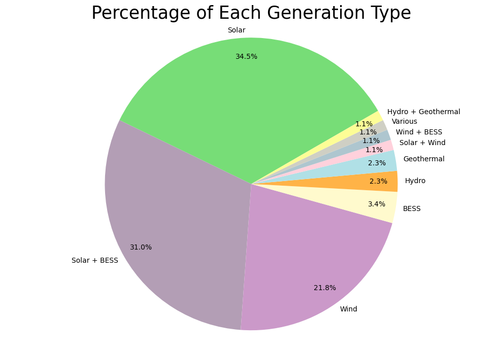

	# Data Analysis Portfolio
## Welcome to my data analysis portfolio! This repository showcases my practical work applying data cleaning, visualization, and interpretation skills to real-world datasets.

# [Project 1: Generation Types for Upcoming Projects in Transpower 2025]

## This analysis examines upcoming generation projects for Transpower in 2025, sourced from the Transpower Connection website. The goal was to assess the types of new generation capacity being developed, their distribution, and potential impacts on New Zealand's energy mix.

### Primary Data: Transpower's connection queue and project listings.
 ### Data Collection: Web scraping/manual extraction from Transpower's site.
 ### Analysis: Python (Pandas, Matplotlib/Seaborn) or Excel.
 ### Visualizations: [Charts/graphs created, e.g., pie charts of generation types, maps of project locations].

*Figure 1: Distribution of Transpower's 2025 generation projects by generation type.*  

 ### The full analysis, including visualizations and detailed insights, can be found here: https://docs.google.com/document/d/1z0NxA09EyHmxdUHQuuQJ1AuOcbz8Appx2B8RHwKY0As/edit?usp=sharing

# [Project 2: Births and Deaths]

## This analysis cracks open 17 years of demographic data to reveal how New Zealanders are being born, living, and dying. Using Stats NZ data (2005-2022), we answer the hard-hitting questions:
